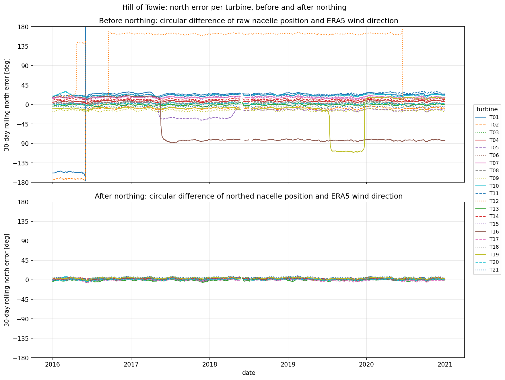
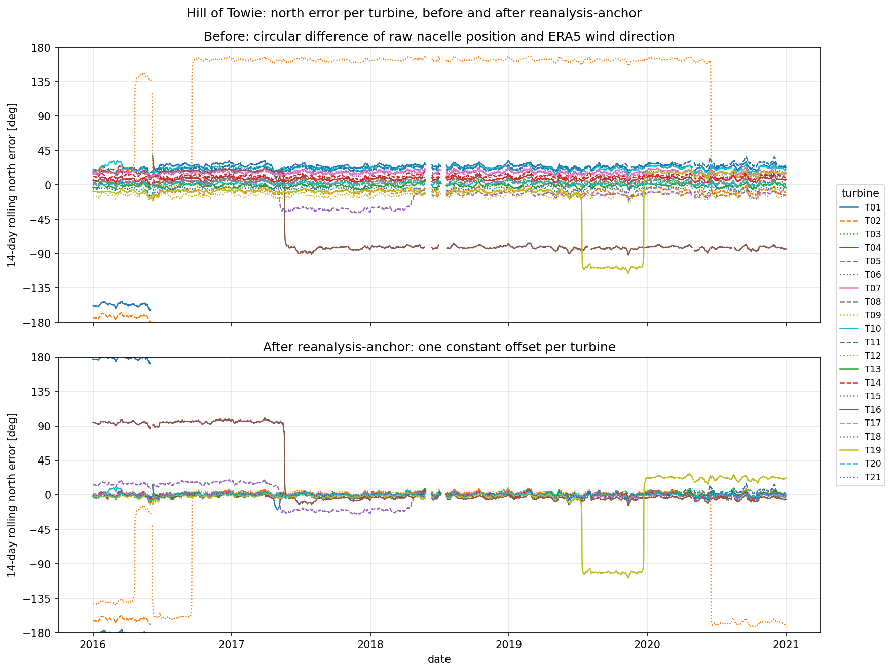
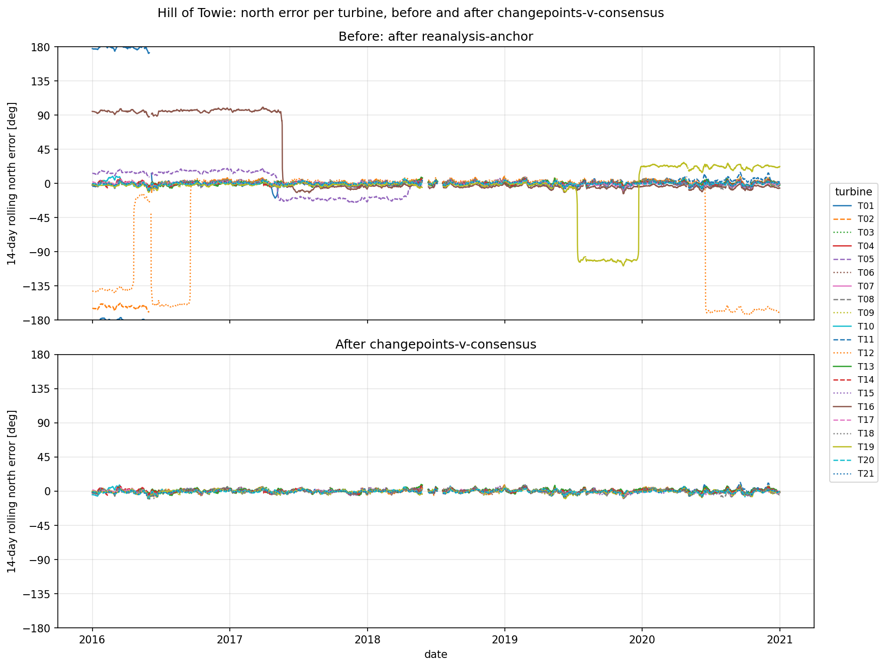
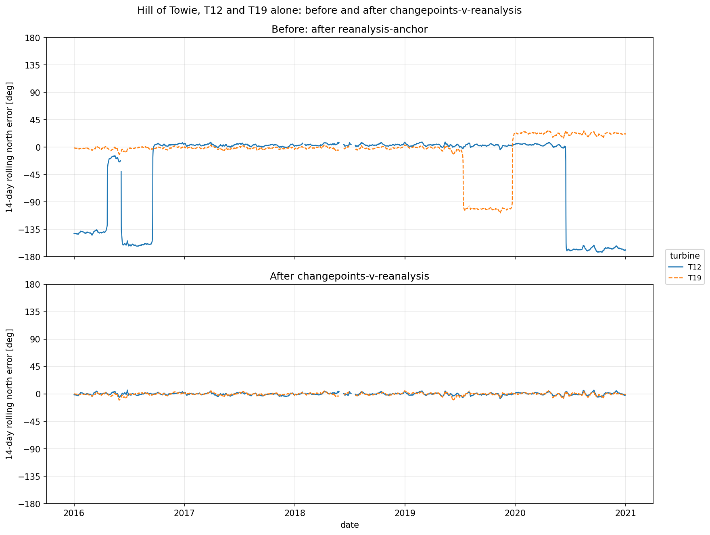
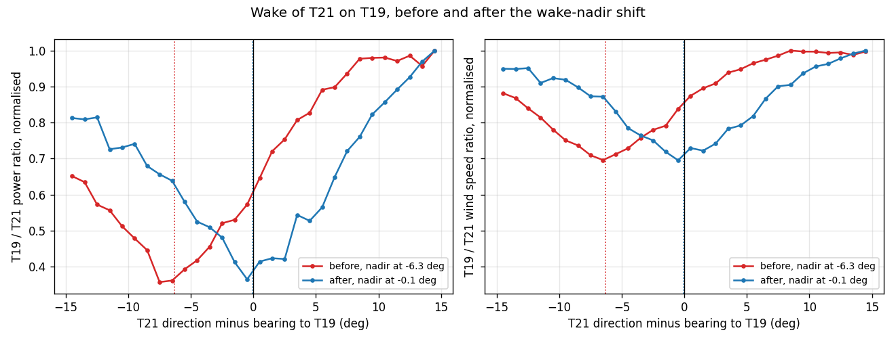
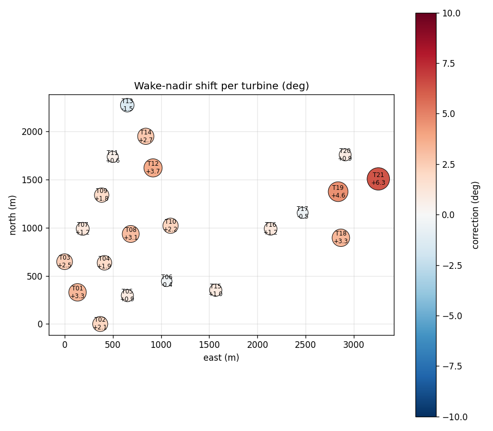

# How wind-up norths a farm

A turbine's nacelle position is only as good as its north calibration. North calibration can get
re-zeroed incorrectly for a variety of reasons, and every direction-dependent calculation inherits
the error. `wind_up.northing.north_farm` finds those offsets and returns one north table per
turbine: a list of `(timestamp, north_offset)` rows, each offset holding until the next. Offsets
are absolute: adding one to the raw signal norths it. `apply_north_table` applies a table, and
`write_north_table_yaml` writes the tables in the same format wind-up uses, so a table can be hand
edited and supplied back.

The figure shows why this matters, on the 21 Hill of Towie turbines over 2016-2020. Each line is
one turbine's 14-day rolling circular median of the circular difference between its nacelle
position and ERA5 wind direction. Before northing (top), most turbines sit tens of degrees off, and
several jump by 30 to 180 degrees when their north calibration is re-zeroed. After applying the
tables `north_farm` discovers (bottom), every turbine stays within about 10 degrees of zero for the
whole five years.

`north_farm` runs up to four steps. Which ones run depends on the farm size and on what the caller
supplies.

| step | runs when | reference | finds changepoints |
|---|---|---|---|
| reanalysis-anchor | always | reanalysis | no |
| changepoints-v-consensus | 3 or more turbines | nearest-neighbour consensus | yes |
| changepoints-v-reanalysis | fewer than 3 turbines | reanalysis | yes, coarser |
| wake-nadir-shift | a layout and power are supplied | wake geometry | no |

The sections below show the same Hill of Towie error before and after each step. All the figures
are drawn by `benchmarking/baselines/study_northing_doc_plot.py`.

## reanalysis-anchor

Each turbine gets one constant offset that nulls its whole-record direction against reanalysis
(ERA5). This step fixes the farm in absolute terms: without it, a farm that is uniformly wrong
looks self-consistent. It finds no changepoints, because reanalysis is unreliable over short
periods: an unusual weather spell moves every turbine's residual together, and correcting that
would write the excursion into the consensus the next step trusts.

On Hill of Towie the anchor pulls the constant spread of the raw signals (top) to zero (bottom).
Every step change survives it, so a turbine with a step sits off zero on at least one side of it.
T01 and T02 stay near 180 degrees for their first five months, and T12, T16 and T19 keep their
large steps.

## The changepoint search

Every step that finds changepoints uses `estimate_north_table`. It takes the circular difference
between a turbine's direction and a reference over the rows where the turbine is generating and
available (`yaw_usable`), and searches that residual for step changes by exact dynamic programming
on a daily grid, then pins each step to native resolution. The residual is first normalised per
direction sector, so site veer (a turbine reading differently from the reference depending on where
the wind comes from) is not mistaken for a step. Each segment's offset is the circular median of
its raw residual, so the correction stays absolute.

The search then prunes what it found. A small step the record later undoes is wander, not a
recalibration, and is dropped. A step with little record either side of it must be larger to
count, because a short segment's level is uncertain. `NorthingSettings` holds the knobs: the
smallest step reported, the shortest segment, the changepoint budget per year, and so on.

## changepoints-v-consensus

For a farm of three or more turbines, each turbine is northed against a consensus of the others,
and this step finds all the changepoints. The consensus is the per-timestamp circular median of
the anchored directions of the turbine's four nearest neighbours by geodesic distance from the
`Layout`. A turbine shares wind with its neighbours, not with the far side of a large farm, and a
miscalibrated turbine elsewhere cannot pull its reference. A consensus stands at a timestamp only
when a strict majority of its turbines report, and never fewer than three.

A neighbour consensus therefore needs at least three neighbours, so it applies from four turbines
upward. A three-turbine farm, or a call with `layout=None`, uses one whole-farm consensus instead:
the median of every turbine, the one being northed included, which stands only when a strict
majority of the farm, and at least three turbines, report.

A neighbour's own step is still in the anchored signals the first consensus is built from, and a
four-turbine median moves when one member steps, which would hand the turbine a matching false
step. So the step repeats: each round rebuilds the consensus from the previous round's tables,
re-northing only turbines whose neighbours changed, until no table moves by more than half a
degree or shifts a changepoint by more than a day.

A turbine whose consensus never overlaps its own usable rows keeps its reanalysis anchor.

On Hill of Towie this step removes every step the anchor left behind, and each turbine lands
within a few degrees of zero.

## changepoints-v-reanalysis

A farm of one or two turbines cannot form a consensus, so each turbine is northed directly against
reanalysis with changepoints. Reanalysis wanders relative to the wind farm's weather, so this step
needs a larger step (10 deg) and a longer gap between changepoints (30 days) before it attributes a
step to the turbine (`against_reanalysis`).

The figure runs `north_farm` on T12 and T19 alone, the two Hill of Towie turbines with the most
dramatic steps. T12 re-zeroes several times, by up to 180 degrees; T19 steps by about 100 degrees
for five months of 2019. Against reanalysis alone, both steps are found and both turbines come
back to zero.

## wake-nadir-shift

The steps above tie the farm's absolute north to reanalysis, so any error in reanalysis's own
direction remains in every table. When `north_farm` is given a layout and power, it shifts each
turbine's table by one constant, read from where its wake lands
(`wind_up.wake_nadir.wake_nadir_offsets`).

A turbine's wake can be assumed to reach a downstream neighbour when the wind blows along the
bearing between them. For each such pair within 10 rotor diameters, the downstream turbine's power
(and, when supplied, nacelle wind speed) relative to the upstream turbine's is binned against the
upstream turbine's northed direction, in 1 deg bins across a 30 deg sector centred on the geometric
bearing. A quadratic fit locates the wake's nadir, where the ratio is lowest. How far the nadir sits from the bearing is the upstream
turbine's residual error. A nadir that is unbracketed, not convex, too shallow or too thinly sampled
is rejected.

The figure shows one pair on Hill of Towie: T21 waking T19. Before the shift (red), T19's power and
wind speed, relative to T21's, reach their nadir 6.3 degrees before T21's northed direction reaches the bearing
between them. T21's shift of +6.3 degrees moves the nadir onto the bearing (blue).

A turbine's pairs are combined by their circular median, so a majority of consistent pairs
outvotes one biased by terrain or wake deflection. A turbine with no resolvable pair takes the
circular median of its nearest resolved turbines, or zero if there are none. The shift moves every
offset in the turbine's table and never changes which rows are valid or where the changepoints are.

The map shows every Hill of Towie turbine's shift. Most are small and positive, with a median of
about 2 degrees, consistent with ERA5's direction being about that far off at this site.

The campaign runner writes this map (`wake_nadir_bubble.png`) with the other northing plots, along
with a before/after wake plot (`wake_nadir_pair_<upstream>_<downstream>.png`) for each of the
three turbines it shifts most. Each one shows the pair whose nadir lands closest to the bearing after
the shift.
